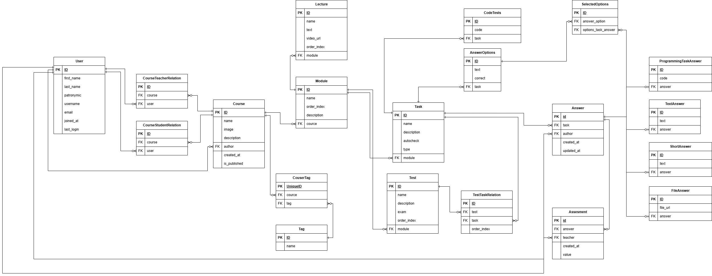

# Сервис открытых курсов

Целью проекта является разработка автоматизированной системы открытых курсов. Система позволит пользователям проходить чужие или бесплатно создавать собственные курсы. Функциональность проекта позволит пользователям создавать образовательные курсы во множестве областей, в частности “математика” и “программирование”. Авторы курсов смогут взымать плату за свои курсы. Также система предоставит возможность эффективной коммуникации с учениками и преподавателями. 

*Предполагается, что в этом репозитории будет MVP-версия проекта.*

## Архитекрутра

Предварительный варинт ERD:

## Стек для MVP

- DJANGO
- DOCKER
- POSTGRES

